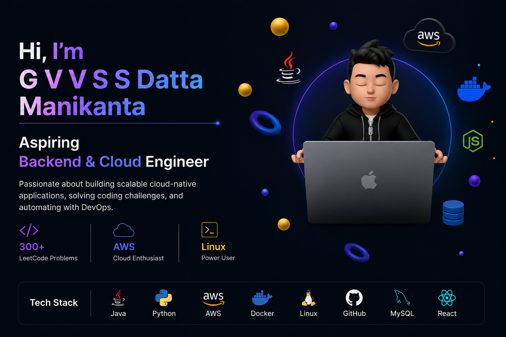

 

 

---

# 👨‍💻 About Me

Hi 👋 I'm **Datta**

🎓 B.Tech Computer Science (IoT) Student

🏫 Aditya College of Engineering and Technology

☁ Backend & Cloud Engineer

⚙ AWS Developer

💻 Java Developer

🚀 Building scalable cloud-native systems

---

### Passionate About

- Cloud Computing
- Backend Engineering
- Linux Administration
- DevOps
- CI/CD Automation
- REST APIs
- Serverless Systems
- System Design

> "I enjoy building systems that solve real problems."

---

# ⚡ Tech Stack

### Languages

### Cloud & DevOps

### Backend

### Frontend

### Tools

---

# 💻 Coding Profiles

---

# 📊 Coding Statistics

  

---

# 🚀 Featured Projects

<table>

<tr>

<td width="50%">

## 🔹 CodeSync

AWS Lambda • API Gateway • Cognito • Firebase • TailwindCSS

Competitive Programming Analytics Dashboard

### Features

- Coding analytics
- AWS Lambda APIs
- Smart reminders
- Cloud dashboards
- Authentication
- CI/CD automation

</td>

<td width="50%">

## 🔹 EventGo

React • Node.js • Express • AWS

College Event Management Platform

### Features

- Event registration
- Backend validation
- REST APIs
- Cloud deployment

</td>

</tr>

<tr>

<td width="50%">

## 🔹 ShadowTrace

Flutter • Dart

Cross Platform Mobile Application

### Features

- Flutter UI
- Mobile application
- Cross platform support

</td>

<td width="50%">

## 🔹 StayHub

React • Firebase • Firestore

Property Rental Platform

### Features

- Property search
- Real-time listings
- Filtering system

</td>

</tr>

</table>

---

# 🏆 Certifications

✅ AWS Certified Developer Associate

✅ RHCSA (Red Hat Certified System Administrator)

✅ Oracle Java Certification

✅ Oracle Generative AI Professional

✅ HTML & CSS Specialist Certification

✅ Python Programming Certification

✅ 50+ Google Cloud Skill Badges

---

# 📈 Competitive Programming

🟡 LeetCode → 300+ Problems

🟢 GeeksForGeeks → 200+ Problems

⭐ HackerRank → 5★ Java | SQL | C

🔵 CodeChef → Competitive Programming

---

# 📊 GitHub Analytics

 

---

# 💼 Experience

### AWS Intern — Technical Hub Pvt Ltd

May 2025 — June 2025

- AWS Lambda
- API Gateway
- IAM
- S3
- CI/CD pipelines
- Serverless deployment

---

### Building Cloud Native Systems ☁

