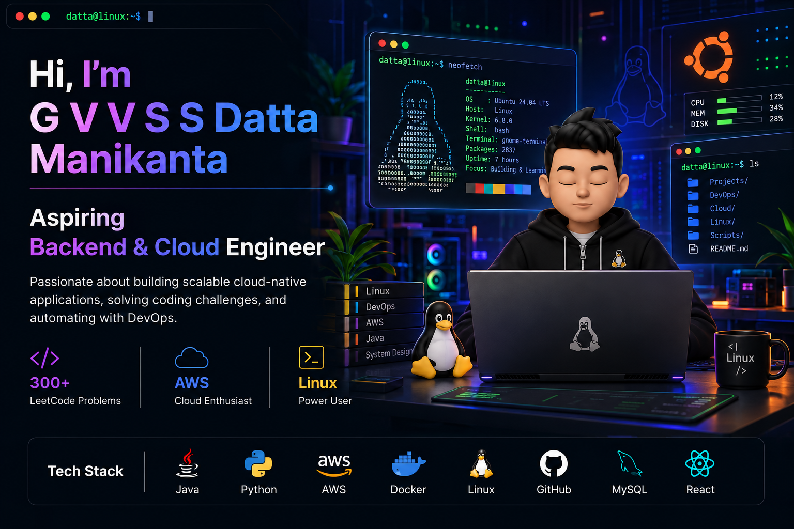

<div align="center">



<br><br>


<br><br>


<br>


<a href="https://saidatta.tech">

</a>

<a href="https://linkedin.com/in/v-v-satya-sai-datta-manikanta-gowthu-41709b291">

</a>

<a href="https://github.com/gowthusaidatta">

</a>

<a href="mailto:saidattagowthu@gmail.com">

</a>

</div>

---
<!--
# 🟢 `datta@gowthu:~$ whoami`

<table>
<tr>
<td width="52%" valign="top">

### 🟢 Identity

| | |
|---|---|
| **USER** | `G V V S Datta Manikanta` |
| **ROLL NO** | `23MH1A4918` |
| **ROLE** | `Backend / Cloud Engineer` |
| **SPECIALITY** | `AWS • Java • Linux • DevOps` |
| **EDUCATION** | `B.Tech CSE (IoT)` |
| **COLLEGE** | `Aditya College of Engineering and Technology` |

</td>
<td width="48%" valign="top">

### 🔵 Runtime

```text
datta@gowthu:~$ status

● ONLINE
● BUILDING
● LEARNING
● DEPLOYING
```

**Portfolio**

`saidatta.tech`

**Email**

`saidattagowthu@gmail.com`

</td>
</tr>
</table>
-->
> 🟢 **MISSION** — Build practical backend systems, automate infrastructure, and turn ideas into scalable cloud-native applications.

### `~/focus`

<div align="center">

| 🟢 Backend | 🔵 Cloud | 🟣 DevOps | 🟠 Engineering |
|:---:|:---:|:---:|:---:|
| REST APIs | AWS / GCP | CI/CD | System Design |
| Java / Node.js | Serverless | Docker | Authentication |
| Databases | Cloud Architecture | Linux | Automation |

</div>

---

# <font color="#FFA116">⚡ Tech Stack</font>

<div align="center">

### <font color="#FFA116">Languages</font>


### <font color="#39FF88">Cloud & DevOps</font>


### <font color="#C084FC">Backend</font>


### <font color="#00D9FF">Frontend</font>


### <font color="#39FF88">Tools</font>


</div>

---

# <font color="#39FF88">💻 Coding Profiles</font>

<div align="center">

<a href="https://leetcode.com/u/G_Saidatta">

</a>

<a href="https://www.hackerrank.com/profile/gowthusaidatta">

</a>

<a href="https://www.codechef.com/users/saidattagowthu">

</a>

<a href="https://www.geeksforgeeks.org/user/saidattagowthu">

</a>

<a href="https://codeforces.com/profile/saidatta_gowthu">

</a>

<a href="https://github.com/gowthusaidatta">

</a>

</div>

---

# <font color="#FFA116">📊 Coding Statistics</font>

<div align="center">


<br><br>


</div>

---

# <font color="#39FF88">🏆 Competitive Programming</font>

<div align="center">

| Platform | Achievement |
|:---:|:---:|
| 🟠 **LeetCode** | **400+ Problems** |
| 🟢 **GeeksForGeeks** | **200+ Problems** |
| ⭐ **HackerRank** | **5★ Java \| SQL \| C** |
| 🟡 **CodeChef** | Competitive Programming |
| 🔵 **Codeforces** | Competitive Programming |

</div>

---

# <font color="#00D9FF">🚀 Featured Projects</font>

<table>
<tr>

<td width="50%">

## 🔹 CodeSync

**AWS Lambda • API Gateway • Cognito • Python • TailwindCSS**

Competitive Programming Analytics Dashboard

### Features

- 📊 Coding analytics
- ☁ AWS Lambda APIs
- 🔔 Smart reminders
- 📈 Cloud dashboards
- 🔐 Authentication
- 🔄 CI/CD automation

</td>

<td width="50%">

## 🔹 EventGo

**React • Node.js • Express • AWS**

College Event Management Platform

### Features

- 📝 Event registration
- ✅ Backend validation
- 🔌 REST APIs
- ☁ Cloud deployment

</td>

</tr>

<tr>

<td width="50%">

## 🔹 ShadowTrace

**Flutter • Dart**

Cross Platform Mobile Application

### Features

- 📱 Flutter UI
- 📲 Mobile application
- 🔄 Cross-platform support

</td>

<td width="50%">

## 🔹 StayHub

**React • Firebase • Firestore**

Property Rental Platform

### Features

- 🏠 Property search
- ⚡ Real-time listings
- 🔎 Filtering system

</td>

</tr>
</table>

---

# 🏆 `datta@gowthu:~$ cat certifications.log`

<div align="center">

<table>
<tr>
<td width="50%" valign="top">

### 🟢 Cloud & Systems

| Status | Certification |
|:---:|---|
| 🟢 `OK` | **AWS Certified Developer Associate** |
| 🟢 `OK` | **RHCSA** — Red Hat Certified System Administrator |
| 🟢 `OK` | **50+ Google Cloud Skill Badges** |

</td>

<td width="50%" valign="top">

### 🔵 Development & AI

| Status | Certification |
|:---:|---|
| 🟢 `OK` | **Oracle Java Certification** |
| 🟢 `OK` | **Oracle Generative AI Professional** |
| 🟢 `OK` | **HTML & CSS Specialist Certification** |
| 🟢 `OK` | **Python Programming Certification** |

</td>
</tr>
</table>

<br>


</div>


# <font color="#39FF88">📊 GitHub Analytics</font>

<div align="center">


<br>


<br><br>


</div>

---

# <font color="#FFA116">💼 Experience</font>

### <font color="#FFA116">AWS Intern — Technical Hub Pvt Ltd</font>

**May 2025 — June 2025**

```text
AWS Lambda
API Gateway
IAM
S3
CI/CD Pipelines
Serverless Deployment
```

---

# 🐧 `datta@gowthu:~$ neofetch`

<table>
<tr>
<td width="34%" align="center" valign="middle">

```text
        .--.
       |o_o |
       |:_/ |
      //   \ \
     (|     | )
    /'\_   _/`\
    \___)=(___/
```

**LINUX DEVELOPER**

`backend • cloud • devops`

</td>

<td width="66%" valign="top">

### `SYSTEM PROFILE`

| Field | Value |
|---|---|
| 🟢 **User** | `Datta` |
| 🟢 **Roll No** | `23MH1A4918` |
| 🔵 **OS** | `Linux` |
| 🔵 **Shell** | `Bash` |
| 🟣 **Editor** | `VS Code` |
| 🟠 **Cloud** | `AWS / GCP` |
| 🟠 **Backend** | `Java / Node.js` |
| 🔵 **Database** | `MySQL / Firestore` |
| 🟢 **DevOps** | `Docker / GitHub Actions / CI/CD` |
| 🟢 **Portfolio** | [`saidatta.tech`](https://saidatta.tech) |
| 🟢 **Status** | `● ONLINE` |

</td>
</tr>
</table>

<div align="center">

`datta@gowthu:~$ systemctl status developer`

**● ACTIVE — running successfully**

</div>


# <font color="#C084FC">`datta@gowthu:~$ git log --oneline`</font>

```text
feat: build cloud-native applications
feat: automate deployment pipelines
feat: improve backend architecture
feat: integrate AWS services
feat: build scalable APIs
chore: keep learning
```

---

<div align="center">

# <font color="#39FF88">`datta@gowthu:~$ ./build-future.sh`</font>

```text
[████████████████████████████████████████] 100%

✓ Backend systems
✓ Cloud infrastructure
✓ Linux
✓ DevOps
✓ Java
✓ System design

BUILD SUCCESSFUL

datta@gowthu:~$ _
```

<br>

### <font color="#00D9FF">Building Cloud Native Systems ☁</font>


</div>
